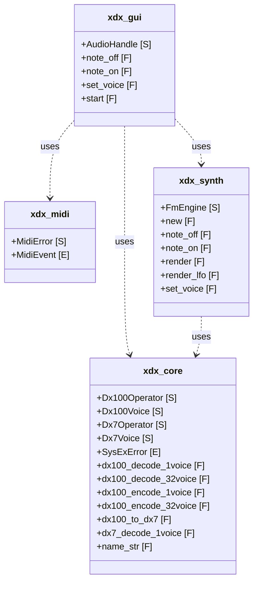

<!-- AUTO-GENERATED — do not edit manually.
     Regenerate: python tools/rust-mermaid.py --preset release --symbols struct,enum,trait,fn,type --out docs/architecture-release.md -->

# Crate Architecture — Release

