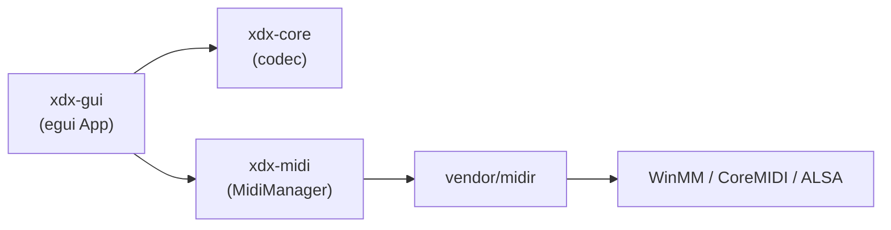
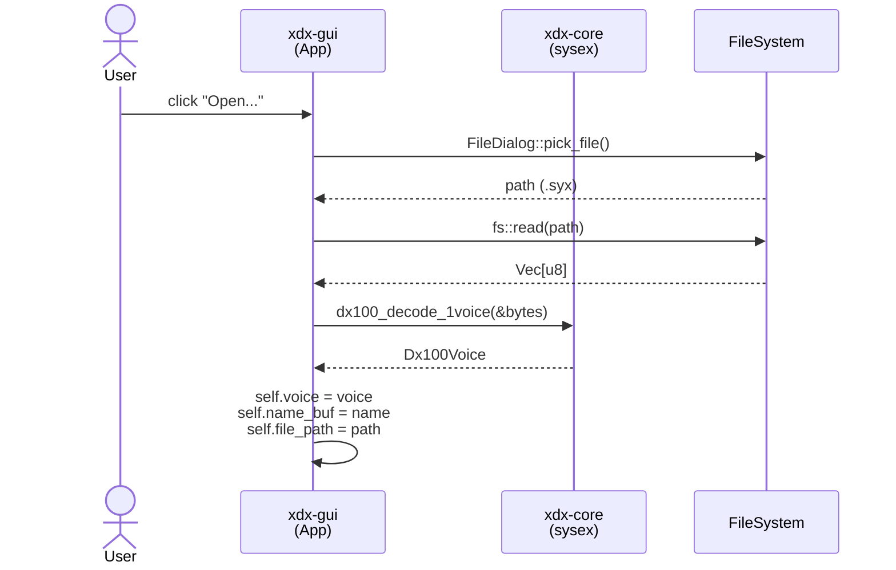
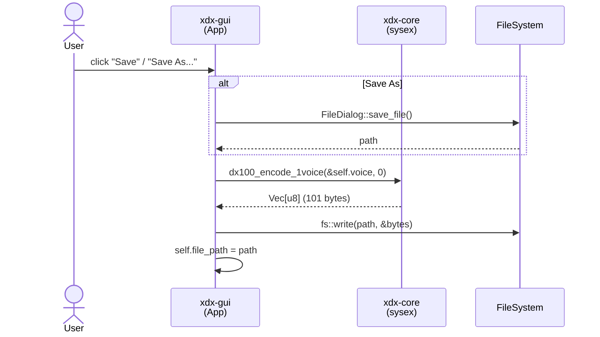
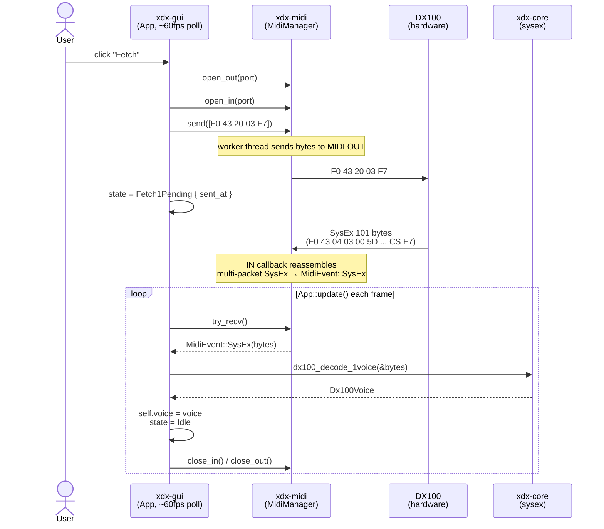
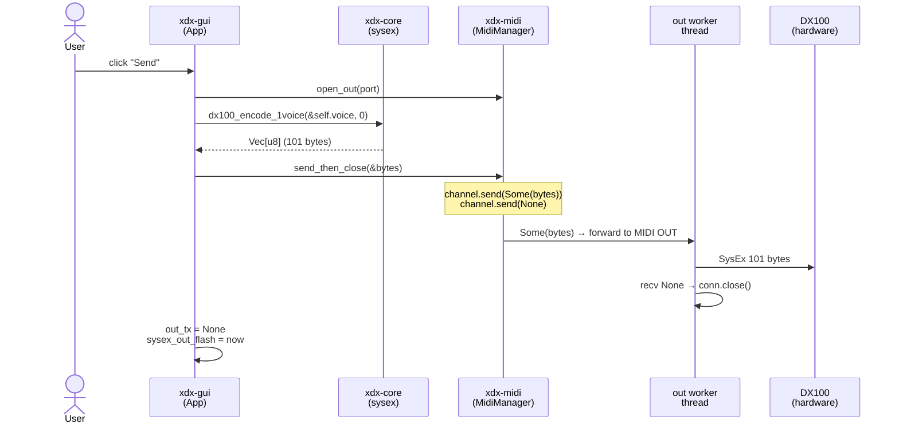
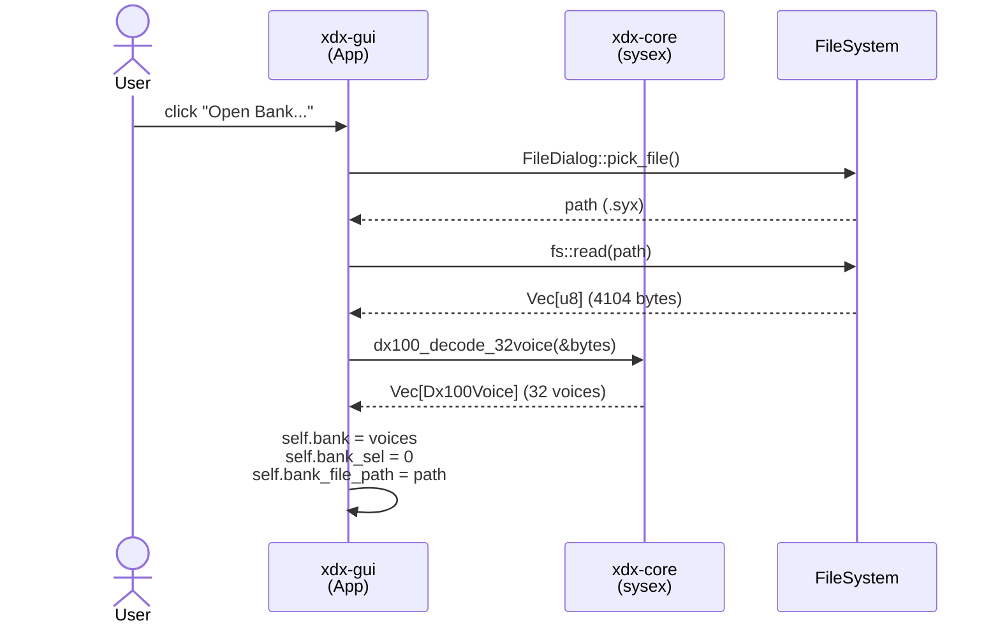
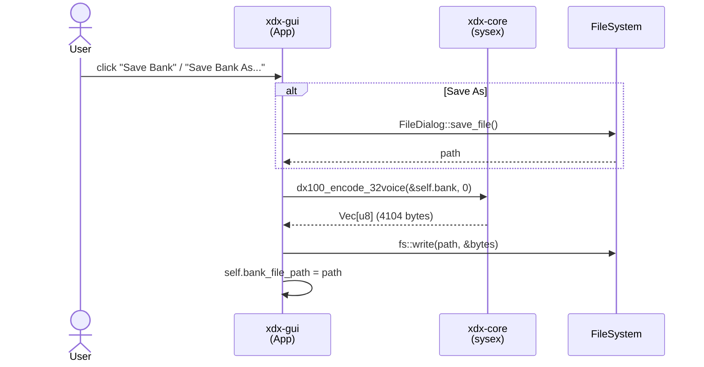
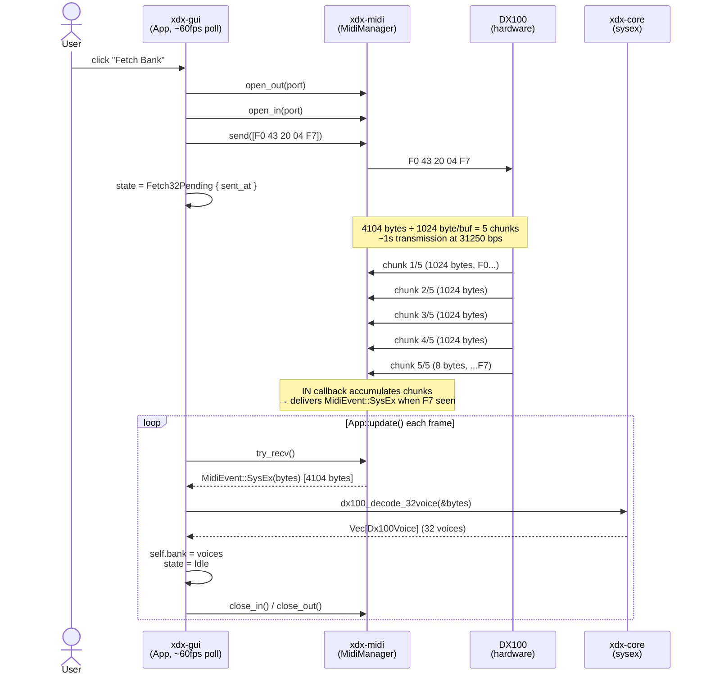
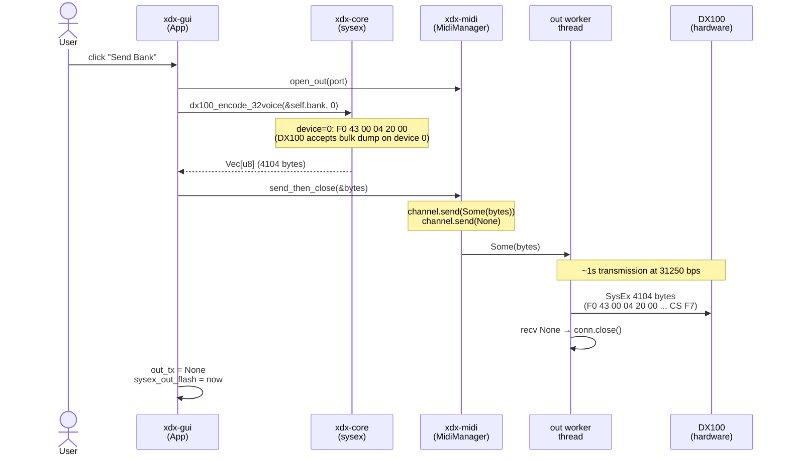

# xdx-rs — シーケンス図

## クレート依存関係

---

## 1-voice: File Open

---

## 1-voice: File Save

---

## 1-voice: SysEx Fetch (synth → PC)

---

## 1-voice: SysEx Send (PC → synth)

---

## 32-voice: File Open

---

## 32-voice: File Save

---

## 32-voice: SysEx Fetch (synth → PC)

---

## 32-voice: SysEx Send (PC → synth)

---

## SysEx フォーマット早見表

| 項目 | 1-voice | 32-voice |
|------|---------|---------|
| Fetch リクエスト | `F0 43 20 03 F7` | `F0 43 20 04 F7` |
| 受信バイト数 | 101 bytes | 4104 bytes (5チャンク) |
| DX100 応答ヘッダ | `F0 43 04 03 00 5D` | `F0 43 04 04 20 00` |
| 送信ヘッダ (device=0) | `F0 43 00 03 00 5D` | `F0 43 00 04 20 00` |
| Fetch タイムアウト | 5s | 30s |
